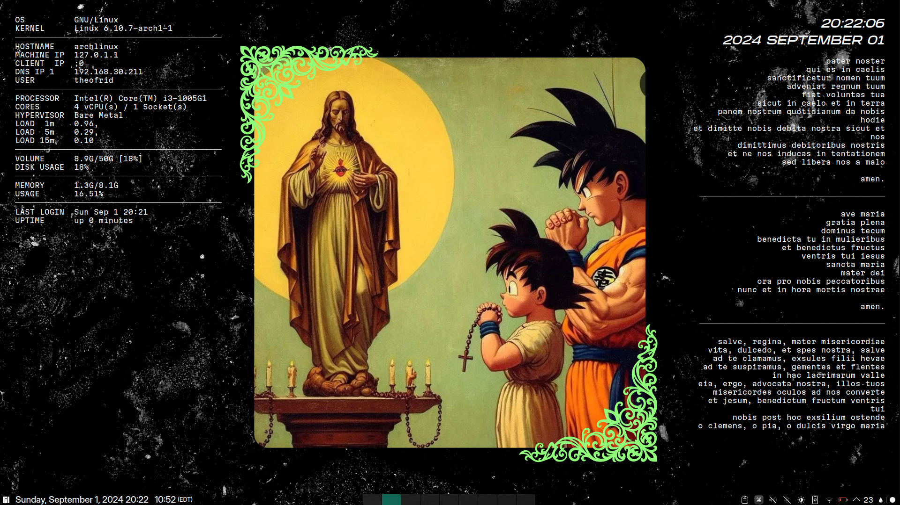

# rice (2024-09-28)

## details

- **os**: arch linux
- **de**: kde plasma
- **terminal**: konsole
- **font**: [martian mono](https://github.com/evilmartians/mono)
- **application style**: [lightly](https://github.com/Luwx/Lightly)
- **plasma style**: [whitesur-kde](https://github.com/vinceliuice/WhiteSur-kde)
- **colors**: [deepinv20-dark](https://github.com/yeyushengfan258/DeepinV20-kde)
- **window decoration**: KDE-gaps-glow
- **icons**: [whitesur icons](https://github.com/vinceliuice/WhiteSur-icon-theme)

## widgets

- scripts: fetch.sh, `cat prayer.txt`
- scripts are displayed as widgets using a widget named [Command Output](https://github.com/Zren/plasma-applet-commandoutput)